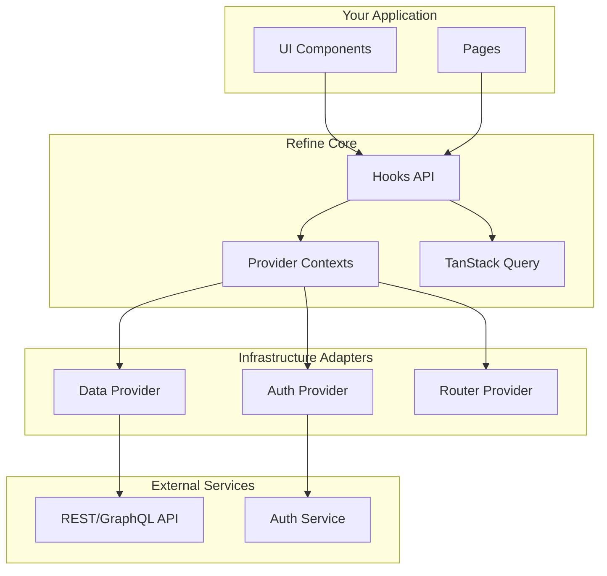
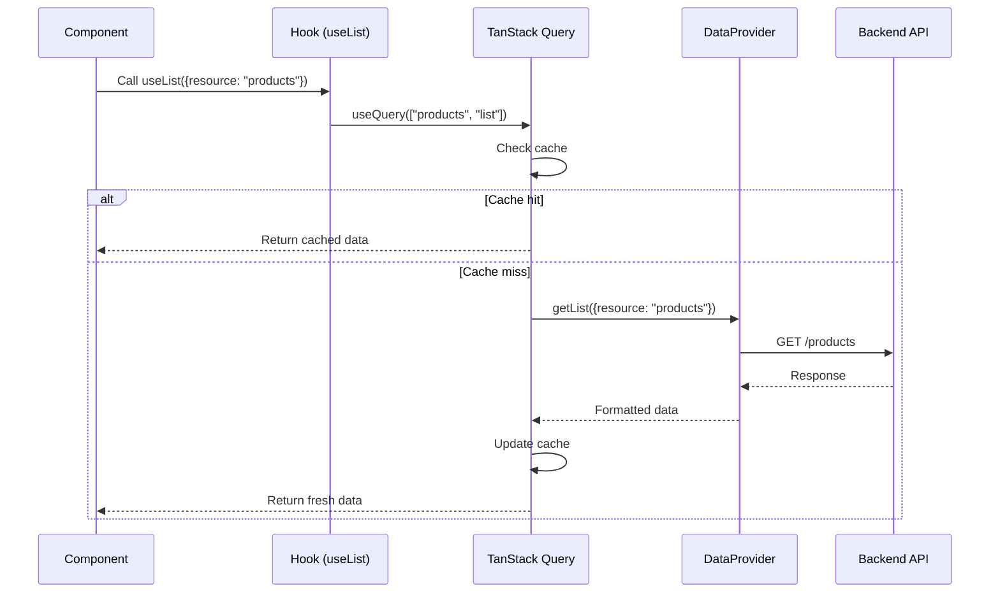
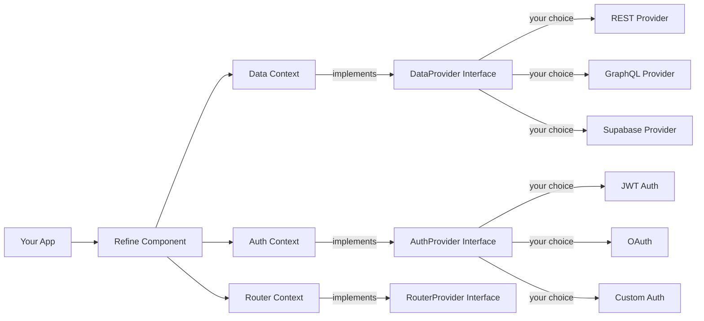

# Refine Architecture Overview

**📅 Documented:** November 18, 2025
**🔬 Tech Stack:** [View Research](TECH_STACK_RESEARCH.md)
**👥 Audience:** All developers
**⏱️ Estimated Reading:** 20-30 minutes

---

## Table of Contents

1. [Introduction](#introduction)
2. [Headless Architecture](#headless-architecture)
3. [Provider Pattern](#provider-pattern)
4. [Resource-Centric Design](#resource-centric-design)
5. [Hook-Based API](#hook-based-api)
6. [Component Composition](#component-composition)
7. [State Management](#state-management)
8. [Architecture Diagrams](#architecture-diagrams)
9. [Comparison with Other Frameworks](#comparison-with-other-frameworks)

---

## Introduction

Refine is built on four core architectural principles:

1. **🎨 Headless Architecture** - Decoupled UI from business logic
2. **🔌 Provider Pattern** - Pluggable infrastructure adapters
3. **📦 Resource-Centric** - Everything organized around resources
4. **🪝 Hook-Based API** - Composable React hooks for all operations

**🧠 Mental Model:**

```
Refine = React Hooks + Provider Pattern + TanStack Query + Smart Defaults
```

---

## Headless Architecture

### What is Headless?

**Headless** means the core framework has **zero UI dependencies**. All UI is provided by you or through optional UI packages.

**🧠 Mental Model:** Refine is the "brain" (logic), you choose the "body" (UI).

### Why Headless?

**Freedom of Choice:**
- ✅ Use any UI framework (Ant Design, MUI, Mantine, Chakra, TailwindCSS, your own)
- ✅ Use any router (React Router, Next.js, Remix, custom)
- ✅ Use any backend (REST, GraphQL, any database)

**Benefits:**
- 🎯 No vendor lock-in
- 🎨 Complete design control
- 🔄 Easy to migrate UI frameworks
- 📦 Smaller bundle sizes (only include what you use)

### The Core Package

```typescript
// packages/core/src/index.tsx

// The core exports ONLY:
// - Hooks (useList, useCreate, useForm, etc.)
// - Contexts (DataContext, AuthContext, etc.)
// - Provider interfaces (TypeScript types)
// - Helper utilities

// NO UI components!
```

✅ **CURRENT (Nov 2025):** This headless approach is the industry standard for enterprise frameworks.

### Headless in Practice

**Without UI Package (Pure Headless):**

```tsx
import { Refine, useList } from "@refinedev/core";

function ProductList() {
  const { data, isLoading } = useList({ resource: "products" });

  // You render with HTML/CSS
  return (
    <div>
      {data?.data.map(product => (
        <div key={product.id}>{product.name}</div>
      ))}
    </div>
  );
}
```

**With UI Package:**

```tsx
import { Refine } from "@refinedev/core";
import { List, useDataGrid } from "@refinedev/mui"; // MUI integration
import { DataGrid } from "@mui/x-data-grid";

function ProductList() {
  const { dataGridProps } = useDataGrid();

  // UI package provides smart components
  return (
    <List>
      <DataGrid {...dataGridProps} />
    </List>
  );
}
```

**🌉 React Developer Bridge:** It's like using `react-hook-form` (headless) vs a full form library with components. You choose the abstraction level.

---

## Provider Pattern

### What are Providers?

**Providers** are adapters between Refine and your infrastructure:

```
Your App → Refine Hooks → Provider → Your Infrastructure
```

**🧠 Mental Model:** Providers are like "translators" - Refine speaks a standard language, providers translate to your specific APIs.

### Core Providers

```tsx
<Refine
  dataProvider={myDataProvider}          // How to fetch data
  authProvider={myAuthProvider}          // How to authenticate
  routerProvider={myRouterProvider}      // How to navigate
  i18nProvider={myI18nProvider}          // How to translate
  notificationProvider={myNotifProvider} // How to show messages
  accessControlProvider={myAccessCtrl}   // How to check permissions
  auditLogProvider={myAuditLog}          // How to log actions
  liveProvider={myLiveProvider}          // How to stream updates
>
  <App />
</Refine>
```

### Provider Interfaces

All providers are **TypeScript interfaces** - you implement them however you want:

```typescript
// packages/core/src/contexts/data/types.ts

export interface DataProvider {
  getList: <TData>(params: GetListParams) => Promise<GetListResponse<TData>>;
  getOne: <TData>(params: GetOneParams) => Promise<GetOneResponse<TData>>;
  getMany: <TData>(params: GetManyParams) => Promise<GetManyResponse<TData>>;
  create: <TData>(params: CreateParams) => Promise<CreateResponse<TData>>;
  update: <TData>(params: UpdateParams) => Promise<UpdateResponse<TData>>;
  deleteOne: <TData>(params: DeleteOneParams) => Promise<DeleteOneResponse<TData>>;
  // ... more methods
}
```

[View full interfaces →](../../packages/core/src/contexts/data/types.ts)

### Why Provider Pattern?

**1. Swappable Infrastructure:**

```tsx
// Development: Use fake API
<Refine dataProvider={dataProvider("https://api.fake-rest.refine.dev")} />

// Production: Use real API
<Refine dataProvider={dataProvider("https://api.example.com")} />
```

**2. Multiple Backends:**

```tsx
<Refine
  dataProvider={{
    default: restProvider,
    cms: strapiProvider,
    auth: supabaseProvider,
  }}
/>

// Different hooks can use different providers!
useList({ resource: "products", dataProviderName: "default" });
useList({ resource: "pages", dataProviderName: "cms" });
```

**3. Easy Testing:**

```tsx
// Mock provider for tests
const mockProvider = {
  getList: jest.fn(() => Promise.resolve({ data: [], total: 0 })),
  // ...
};

<Refine dataProvider={mockProvider} />
```

**🌉 React Developer Bridge:** Like React's Context API, but specifically for infrastructure concerns.

---

## Resource-Centric Design

### What is a Resource?

A **resource** is an entity you want to manage (users, products, orders, etc.).

**🧠 Mental Model:** Resources are like "models" in MVC or "entities" in your database.

### Resource Definition

```tsx
<Refine
  resources={[
    {
      name: "products",           // Resource identifier (matches API endpoint)
      list: "/products",          // List view route
      create: "/products/create", // Create view route
      edit: "/products/edit/:id", // Edit view route
      show: "/products/show/:id", // Show view route
      meta: {                     // Metadata
        label: "Products",
        icon: <ProductIcon />,
        canDelete: true,
      },
    },
    {
      name: "categories",
      list: "/categories",
      // ... more resources
    },
  ]}
/>
```

### Resource Actions

Every resource can have standard CRUD actions:

| Action | Purpose | Hook Example |
|--------|---------|--------------|
| **list** | Show all records | `useList({ resource: "products" })` |
| **create** | Create new record | `useCreate({ resource: "products" })` |
| **edit** | Update existing record | `useUpdate({ resource: "products" })` |
| **show** | Display single record | `useOne({ resource: "products" })` |
| **delete** | Remove record | `useDelete({ resource: "products" })` |

### Automatic Route Generation

Resources automatically generate:
- ✅ Menu items
- ✅ Routes
- ✅ Breadcrumbs
- ✅ Navigation helpers

**💡 Aha Moment:** You define resources once, Refine handles routing, navigation, and data fetching!

---

## Hook-Based API

### Why Hooks?

Refine provides **30+ React hooks** that handle common operations:

**Benefits:**
- ✅ Composable and reusable
- ✅ TypeScript-first with inference
- ✅ Follows React patterns
- ✅ Easy to test

### Hook Categories

**Data Fetching Hooks:**
```tsx
useList()      // Fetch list with pagination, filtering, sorting
useOne()       // Fetch single record
useMany()      // Fetch multiple specific records
useInfiniteList() // Infinite scrolling
```

**Mutation Hooks:**
```tsx
useCreate()    // Create record
useUpdate()    // Update record
useDelete()    // Delete record
useDeleteMany()// Delete multiple
```

**Form Hooks:**
```tsx
useForm()      // Complete form management
useStepsForm() // Multi-step forms
useDrawerForm()// Form in drawer
useModalForm() // Form in modal
```

**Table Hooks:**
```tsx
useTable()     // Complete table management
useDataGrid()  // DataGrid integration (MUI)
```

**Auth Hooks:**
```tsx
useLogin()
useLogout()
useRegister()
usePermissions()
useGetIdentity()
```

**Navigation Hooks:**
```tsx
useGo()        // Navigate
useBack()      // Go back
useParsed()    // Parse current route
```

[Complete hooks reference →](HOOKS_GUIDE.md)

### Hooks Composition

Hooks are designed to compose:

```tsx
function ProductEdit() {
  // Form management
  const { formProps, saveButtonProps, queryResult } = useForm();

  // Get categories for select
  const { selectProps } = useSelect({
    resource: "categories",
  });

  // Check permission
  const { data: canEdit } = usePermissions();

  // Get user info
  const { data: identity } = useGetIdentity();

  // Compose them together!
  return (
    <Form {...formProps}>
      <Input name="name" />
      <Select {...selectProps} />
      <Button {...saveButtonProps}>Save</Button>
    </Form>
  );
}
```

**🌉 React Developer Bridge:** Just like `useState`, `useEffect`, etc. - Refine hooks follow the same rules and can be composed.

---

## Component Composition

### Minimal Core Components

The core package provides **only essential components**:

```tsx
// packages/core/src/components/

<Refine />           // Root configuration component
<Authenticated />    // Auth guard wrapper
<CanAccess />        // Permission guard wrapper
<RouteChangeHandler /> // Route sync helper
```

**Everything else comes from UI packages or you build it!**

### UI Package Components

UI packages (e.g., `@refinedev/antd`, `@refinedev/mui`) provide:

**Layout Components:**
```tsx
<ThemedLayout />     // Complete layout with sidebar, header
<Sider />           // Sidebar with menu
<Header />          // Header with user menu
```

**Page Components:**
```tsx
<List />            // List page wrapper
<Create />          // Create page wrapper
<Edit />            // Edit page wrapper
<Show />            // Show page wrapper
```

**CRUD Components:**
```tsx
<DeleteButton />
<EditButton />
<ShowButton />
<RefreshButton />
// ... many more
```

### Component Hierarchy

```
<Refine>                           (Core - Configuration)
  <BrowserRouter>                  (Router)
    <ThemedLayout>                 (UI Package - Layout)
      <Sider>                      (UI Package - Sidebar)
        <Menu />                   (UI Package - Navigation)
      </Sider>
      <Routes>                     (Router)
        <Route path="/products">
          <List>                   (UI Package - Page Wrapper)
            <DataGrid />           (Your choice - Data display)
          </List>
        </Route>
      </Routes>
    </ThemedLayout>
  </BrowserRouter>
</Refine>
```

---

## State Management

### TanStack Query Integration

Refine uses **TanStack Query (React Query)** for server state management:

```tsx
// Under the hood, useList() uses TanStack Query
const { data, isLoading, refetch } = useList({ resource: "products" });

// Equivalent to:
const { data, isLoading, refetch } = useQuery({
  queryKey: ["products", "list"],
  queryFn: () => dataProvider.getList({ resource: "products" }),
});
```

**Benefits:**
- ✅ Automatic caching
- ✅ Background refetching
- ✅ Optimistic updates
- ✅ Request deduplication
- ✅ Infinite scrolling support

✅ **CURRENT (Nov 2025):** Project uses TanStack Query v5.81.5 (modern v5 API).

[TanStack Query details →](TECH_STACK_RESEARCH.md#tanstack-query-react-query---v5815)

### State Layers

```
┌─────────────────────────────────┐
│ Component State (useState)      │ ← UI state
├─────────────────────────────────┤
│ Server State (TanStack Query)   │ ← Data from API
├─────────────────────────────────┤
│ Router State (URL params)       │ ← Navigation state
├─────────────────────────────────┤
│ Provider State (Context API)    │ ← Configuration
└─────────────────────────────────┘
```

**🧠 Mental Model:** Refine manages server state, you manage UI state.

### Mutation Modes

Refine supports three mutation strategies:

**1. Pessimistic (Default):**
```tsx
// Wait for server response before updating UI
await updateProduct(data);
// Then update UI
```

**2. Optimistic:**
```tsx
// Update UI immediately
updateUIOptimistically(data);
// Send request in background
await updateProduct(data);
// Rollback if failed
```

**3. Undoable:**
```tsx
// Update UI with "Undo" notification
updateUIWithUndo(data);
// Wait 5 seconds
await sleep(5000);
// Then send request
await updateProduct(data);
```

Configure globally or per-operation:

```tsx
<Refine
  options={{ mutationMode: "optimistic" }}
/>

// Or per-operation
useUpdate({ mutationMode: "undoable" });
```

---

## Architecture Diagrams

### System Architecture



### Request Flow



### Provider Pattern Flow



---

## Comparison with Other Frameworks

### Refine vs Traditional Admin Frameworks

| Feature | Refine | Traditional (AdminJS, etc.) |
|---------|--------|----------------------------|
| **UI** | Headless (your choice) | Opinionated/locked-in |
| **Router** | Pluggable | Built-in only |
| **Backend** | Any (via providers) | Specific to framework |
| **Learning Curve** | Medium (React knowledge) | Low (but limited) |
| **Flexibility** | Very High | Low |
| **Bundle Size** | Small (tree-shakeable) | Large (includes everything) |
| **TypeScript** | First-class | Varies |

### Refine vs Next.js

**They're complementary!**

- **Next.js**: Full-stack React framework (routing, SSR, etc.)
- **Refine**: CRUD/Admin layer on top of React

**You can use both together:**

```tsx
// Next.js 15 App Router + Refine
import { Refine } from "@refinedev/core";
import routerProvider from "@refinedev/nextjs-router";

export default function RootLayout({ children }) {
  return (
    <Refine
      routerProvider={routerProvider}
      // ... other providers
    >
      {children}
    </Refine>
  );
}
```

✅ **CURRENT (Nov 2025):** Next.js App Router is the standard for 2025. Refine has full support.

[Next.js integration guide →](ROUTING_GUIDE.md#nextjs-integration)

### Refine vs React Admin

| Aspect | Refine | React Admin |
|--------|--------|-------------|
| **Philosophy** | Headless | Material UI focused |
| **TypeScript** | Native | Added later |
| **State** | TanStack Query | Redux/React Query |
| **Providers** | More flexible | More opinionated |
| **Bundle** | Smaller | Larger |
| **Learning** | React hooks | DSL + Components |

**Both are excellent!** Choose based on:
- **React Admin**: Want Material UI by default
- **Refine**: Want UI flexibility

---

## Key Architectural Decisions

### 1. Why Headless?

**Decision:** Decouple UI from business logic

**Rationale:**
- Different teams have different UI requirements
- UI frameworks evolve quickly
- Smaller core bundle
- Easier to test business logic

**Trade-off:** Slightly more setup vs opinionated framework

### 2. Why Provider Pattern?

**Decision:** Use providers for all infrastructure

**Rationale:**
- Swap backends without changing app code
- Easy mocking for tests
- Support multiple data sources
- Clear separation of concerns

**Trade-off:** Need to understand provider interfaces

### 3. Why TanStack Query?

**Decision:** Use TanStack Query for data fetching

**Rationale:**
- Industry standard for React data fetching
- Excellent caching and performance
- Built-in optimistic updates
- Active maintenance

**Trade-off:** Learning curve if new to React Query

### 4. Why TypeScript-First?

**Decision:** TypeScript is not optional

**Rationale:**
- Type safety prevents bugs
- Better DX with autocomplete
- Industry standard for enterprise
- Self-documenting code

**Trade-off:** None (TypeScript is essential in 2025)

---

## Summary

**Refine Architecture in Three Sentences:**

1. **Headless core** provides hooks and provider interfaces
2. **Provider pattern** adapts Refine to your infrastructure
3. **UI packages** (optional) provide pre-built components

**🎯 Remember This:**

```
Refine = Smart Hooks + Provider Pattern + UI Freedom
```

**🌉 For React Developers:**

Refine is essentially a collection of **really smart React hooks** that handle all the boring parts of CRUD apps (data fetching, forms, tables, auth) plus a **provider system** to connect to any backend.

---

## Next Steps

**Understanding the architecture? Great! Now:**

**🎯 Learn the patterns:**
→ [Core Concepts](CORE_CONCEPTS.md)

**🎯 Master the hooks:**
→ [Hooks Guide](HOOKS_GUIDE.md)

**🎯 Understand providers:**
→ [Providers Guide](PROVIDERS_GUIDE.md)

**🎯 See it in action:**
→ [Data Flow Guide](DATA_FLOW_GUIDE.md)

**🎯 Build something:**
→ [How-To Guide](HOW_TO_GUIDE.md)

---

**Document Version:** 1.0
**Last Updated:** November 18, 2025
**Next Review:** After architecture changes
