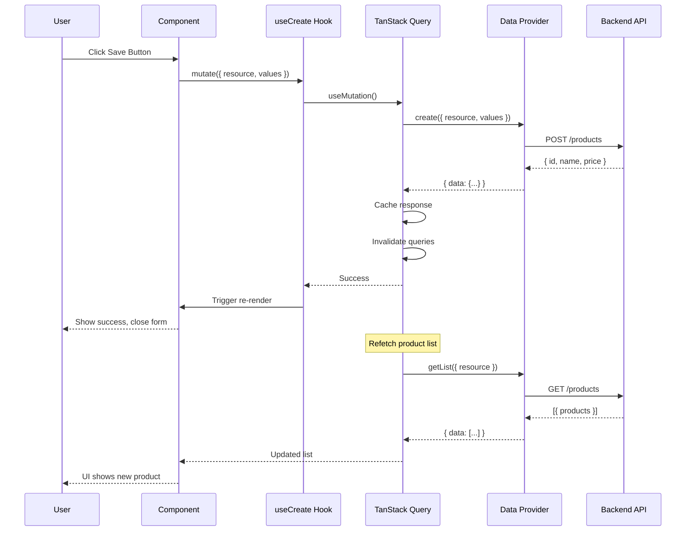
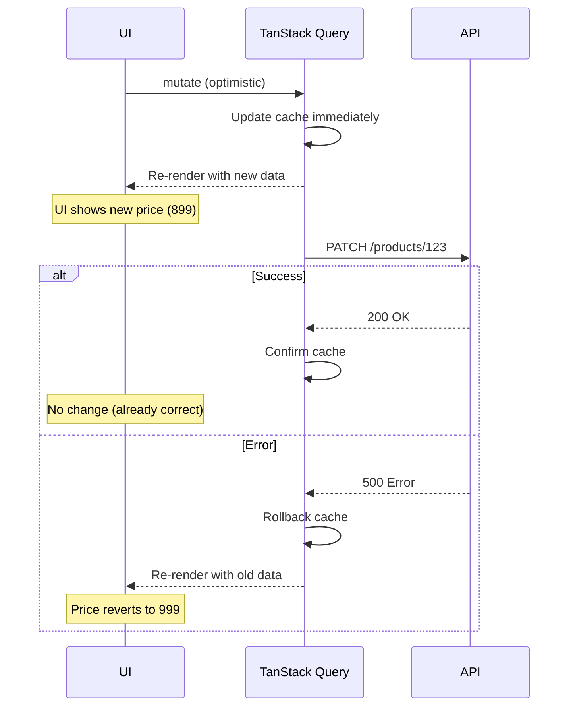
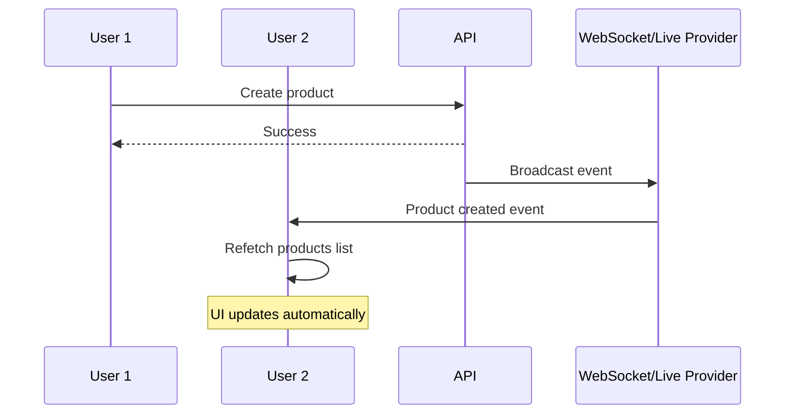

# Data Flow Guide

**📅 Documented:** November 18, 2025
**🔬 Tech Stack:** [View Research](TECH_STACK_RESEARCH.md)
**👥 Audience:** All developers
**⏱️ Estimated Reading:** 20-25 minutes

---

## Overview

This guide traces a **complete request lifecycle** in Refine from user interaction to UI update.

**🧠 Mental Model:** Follow the data like following a river from source to sea.

---

## The Complete Journey

```
User Click
  ↓
UI Event Handler
  ↓
Refine Hook (useCreate, useUpdate, etc.)
  ↓
TanStack Query
  ↓
Data Provider
  ↓
HTTP Request → Backend API
  ↓
Response ← Backend API
  ↓
Data Provider (format response)
  ↓
TanStack Query (cache + notify)
  ↓
Hook Returns Updated Data
  ↓
React Re-renders Component
  ↓
UI Updates
```

---

## Example: Creating a Product

Let's trace creating a product from button click to success notification.

### 1. User Interaction

```tsx
// ProductCreate.tsx
function ProductCreate() {
  const { formProps, saveButtonProps } = useForm();

  return (
    <form {...formProps}>
      <input name="name" />
      <input name="price" />
      <button {...saveButtonProps}>Save</button>  {/* ← User clicks here */}
    </form>
  );
}
```

### 2. Hook Execution

```typescript
// Inside useForm hook
const { mutate } = useCreate();  // ← Hook wraps TanStack Query mutation

const handleSubmit = (values) => {
  mutate({
    resource: "products",
    values: {
      name: values.name,
      price: values.price
    }
  });
};
```

### 3. TanStack Query Layer

```typescript
// Inside useCreate
const mutation = useMutation({
  mutationKey: ["products", "create"],
  mutationFn: async (params) => {
    // Call data provider
    return dataProvider.create(params);
  },
  onSuccess: (data) => {
    // Invalidate cache
    queryClient.invalidateQueries(["products", "list"]);
    // Show notification
    notify({ message: "Product created!" });
  }
});
```

### 4. Data Provider

```typescript
// dataProvider.create()
export const dataProvider: DataProvider = {
  create: async ({ resource, variables }) => {
    // Make HTTP request
    const response = await axios.post(
      `${API_URL}/${resource}`,
      variables
    );

    // Format response
    return {
      data: response.data
    };
  }
};
```

### 5. HTTP Request

```
POST https://api.example.com/products
Content-Type: application/json

{
  "name": "iPhone 15",
  "price": 999
}
```

### 6. Backend Response

```json
{
  "id": 123,
  "name": "iPhone 15",
  "price": 999,
  "createdAt": "2025-11-18T10:00:00Z"
}
```

### 7. Response Processing

```typescript
// Back in data provider
return {
  data: {
    id: 123,
    name: "iPhone 15",
    price: 999,
    createdAt: "2025-11-18T10:00:00Z"
  }
};
```

### 8. Cache Invalidation

```typescript
// TanStack Query invalidates related queries
queryClient.invalidateQueries(["products", "list"]);

// This triggers refetch of product list
// UI automatically updates!
```

### 9. UI Update

```tsx
// ProductList.tsx - Automatically refetches!
function ProductList() {
  const { data } = useList({ resource: "products" });
  //    ^? Now includes the new product!

  return (
    <table>
      {data?.data.map(product => (
        <tr key={product.id}>  {/* ← New product appears! */}
          <td>{product.name}</td>
          <td>{product.price}</td>
        </tr>
      ))}
    </table>
  );
}
```

---

## Sequence Diagram



---

## Data Fetching Flow (Read Operations)

### Example: Loading Product List

```tsx
function ProductList() {
  const { data, isLoading } = useList({
    resource: "products",
    pagination: { current: 1, pageSize: 10 },
    filters: [{ field: "category", operator: "eq", value: "phones" }]
  });
}
```

**Flow:**

1. **Component Mounts**
2. **useList Hook Executes**
3. **TanStack Query Checks Cache**
   - Cache hit? Return immediately
   - Cache miss? Fetch from server
4. **Data Provider Transforms Params**
```typescript
// Refine params → API params
{
  resource: "products",
  pagination: { current: 1, pageSize: 10 },
  filters: [{ field: "category", operator: "eq", value: "phones" }]
}
// becomes
GET /products?page=1&limit=10&category=phones
```
5. **HTTP Request Sent**
6. **Response Received & Cached**
7. **Component Re-renders with Data**

---

## Optimistic Updates

### Flow with Optimistic UI

```typescript
// useUpdate with optimistic mode
const { mutate } = useUpdate({
  mutationMode: "optimistic"
});

mutate({
  resource: "products",
  id: 123,
  values: { price: 899 }  // Reduced price
});
```

**Timeline:**

```
T+0ms:   User clicks "Update"
T+0ms:   UI updates IMMEDIATELY (optimistic)
         Price shows 899 (before server confirms!)
T+100ms: HTTP request sent to server
T+300ms: Server responds success
         Cache updated with server data
         UI already showed correct data!

// If server fails:
T+300ms: Server responds error
         UI ROLLS BACK to previous value (999)
         Show error notification
```

**Sequence:**



---

## Cache Management

### How TanStack Query Caches Data

```typescript
// Query Key Structure
["resource", "action", ...params]

// Examples:
["products", "list", { page: 1 }]
["products", "detail", { id: 123 }]
["categories", "list", {}]
```

### Cache Invalidation

```typescript
// After creating a product
queryClient.invalidateQueries(["products", "list"]);
// ↓
// Refetches all product list queries

// After updating product 123
queryClient.invalidateQueries(["products", "detail", { id: 123 }]);
// ↓
// Refetches that specific product

// Invalidate everything
queryClient.invalidateQueries();
```

### Automatic Invalidation

Refine hooks automatically invalidate related queries:

```typescript
useCreate() // Invalidates: list queries
useUpdate() // Invalidates: list + detail queries
useDelete() // Invalidates: list queries
```

---

## Error Handling Flow

```typescript
const { mutate } = useCreate({
  onError: (error) => {
    // Custom error handling
    console.error(error);
  }
});
```

**Error Propagation:**

```
Backend Error (500)
  ↓
Data Provider catches
  ↓
Throws HttpError
  ↓
TanStack Query catches
  ↓
Hook onError callback
  ↓
Default notification shown
  ↓
Component receives error state
```

**Error Object:**

```typescript
interface HttpError {
  message: string;
  statusCode: number;
  errors?: ValidationErrors;
}

// In component
const { error } = useCreate();

if (error) {
  console.log(error.message);     // "Product creation failed"
  console.log(error.statusCode);  // 400
  console.log(error.errors);      // { name: "Required field" }
}
```

---

## Real-Time Updates

### With Live Provider

```tsx
// Enable live updates
const { data } = useList({
  resource: "products",
  liveMode: "auto",  // ← Subscribe to changes
});

// When another user creates/updates/deletes a product:
// 1. Live provider receives event
// 2. Query automatically refetches
// 3. UI updates in real-time!
```

**Flow:**



---

## Authentication Flow

```typescript
// Login flow
const { mutate } = useLogin();

mutate({ email, password });
```

**Sequence:**

```
1. User submits login form
   ↓
2. useLogin hook calls authProvider.login()
   ↓
3. Auth provider makes API request
   ↓
4. Backend returns token
   ↓
5. Auth provider stores token (localStorage/cookie)
   ↓
6. Auth provider returns user identity
   ↓
7. Refine updates auth context
   ↓
8. Protected routes become accessible
   ↓
9. Navigate to dashboard
```

**Subsequent Requests:**

```typescript
// Data provider adds auth header
const dataProvider = {
  getList: async (params) => {
    const token = localStorage.getItem("token");

    return axios.get(url, {
      headers: {
        Authorization: `Bearer ${token}`
      }
    });
  }
};
```

---

## Summary

**Key Flows:**

1. **Create/Update/Delete:** Component → Hook → TanStack Query → Provider → API
2. **Read:** Component → Hook → TanStack Query (cache check) → Provider → API
3. **Optimistic:** Update UI first, then sync with server
4. **Real-time:** WebSocket → Live Provider → Auto-refetch → UI update
5. **Auth:** Login → Store token → Add to requests → Access protected routes

**🎯 Remember:**

```
User Action → Refine Hook → TanStack Query → Provider → API → Cache → UI
```

---

## Next Steps

**Understand providers:**
→ [Providers Guide](PROVIDERS_GUIDE.md)

**Master hooks:**
→ [Hooks Guide](HOOKS_GUIDE.md)

**Learn patterns:**
→ [Patterns & Conventions](PATTERNS_AND_CONVENTIONS.md)

---

**Document Version:** 1.0
**Last Updated:** November 18, 2025
